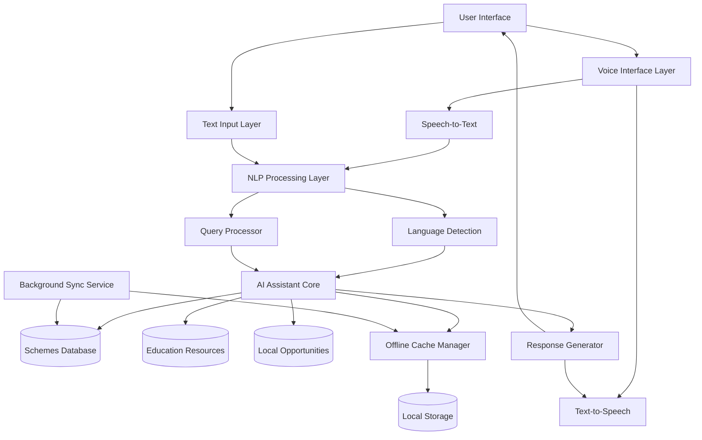

# Design Document: Government Services Platform

## Overview

The Government Services Platform is a multilingual, AI-powered information system designed to democratize access to government services, education resources, and local opportunities. The platform addresses the digital divide by supporting voice interaction, operating in low-connectivity environments, and providing information in multiple regional languages.

### Key Design Principles

1. **Accessibility First**: Design for users with varying literacy levels and digital skills
2. **Offline Resilience**: Core functionality must work with minimal or no internet connectivity
3. **Language Inclusivity**: Support multiple languages without compromising user experience
4. **Conversational Interface**: Natural language interaction as the primary mode
5. **Privacy by Design**: Minimize data collection and maximize user control

### Technology Stack Considerations

- **AI/NLP**: Large Language Model (LLM) with multilingual capabilities (e.g., GPT-4, Claude, or open-source alternatives like BLOOM)
- **Speech Processing**: Speech-to-Text (STT) and Text-to-Speech (TTS) engines with regional language support
- **Backend**: Scalable API layer with caching and queue management
- **Database**: Hybrid approach with cloud database for schemes/resources and local SQLite for offline cache
- **Frontend**: Progressive Web App (PWA) for cross-platform support and offline capabilities

### Use Case Diagram

graph TB

User[User / Citizen]
Admin[Admin]
AI[AI System]
API[Government Data Source]

subgraph AI_Community_Access_Assistant
    UC1((Authenticate User))
    UC2((Submit Query))
    UC3((Retrieve Government Scheme Information))
    UC4((Access Education Resources))
    UC5((Translate Content to Local Language))
    UC6((Interact via Voice Interface))
    UC7((Provide Feedback))
    UC8((Manage Content))
    UC9((Monitor System Usage))
end

User --> UC1
User --> UC2
User --> UC3
User --> UC4
User --> UC5
User --> UC6
User --> UC7

Admin --> UC8
Admin --> UC9

UC2 --> AI
UC3 --> API
UC4 --> API


### User Interface Wireframes
graph TB

H1[Header: Logo + Language Selector]
H2[Large Search Bar]
H3[Voice Input Button]
H4[Government Schemes Card]
H5[Education Resources Card]
H6[Local Help Card]

H1 --> H2 --> H3
H3 --> H4
H3 --> H5
H3 --> H6

C1[Chat Window Layout]
C2[User Message Area]
C3[AI Response Section]
C4[Translate Button]
C5[Low Bandwidth Toggle]

C1 --> C2 --> C3
C3 --> C4
C3 --> C5

G1[Filter Sidebar: Category / Eligibility]
G2[Scheme Cards List]
G3[Apply Button]
G4[Learn More Button]

G1 --> G2 --> G3
G2 --> G4

E1[Search Panel]
E2[Recommendation Panel]
E3[Resource Cards Grid]

E1 --> E3
E2 --> E3

A1[Manage Content Panel]
A2[Usage Analytics Section]
A3[Update Resources Form]

A1 --> A2 --> A3


### High-Level Architecture



### Component Architecture

The system follows a layered architecture:

1. **Presentation Layer**: User interface (web/mobile PWA)
2. **Interface Layer**: Voice and text input handlers
3. **Processing Layer**: NLP, language detection, query processing
4. **Intelligence Layer**: AI assistant with context management
5. **Data Layer**: Databases and caching systems
6. **Sync Layer**: Background services for data updates and offline sync

### Offline-First Strategy

The platform uses a tiered approach to handle connectivity:

- **Tier 1 (Online)**: Full AI capabilities with real-time database access
- **Tier 2 (Low Connectivity)**: Cached AI responses with local database queries
- **Tier 3 (Offline)**: Pre-cached content and rule-based responses

## Components and Interfaces

### 1. Voice Interface Component

**Responsibilities:**
- Convert speech to text in multiple languages
- Convert text responses to speech
- Handle noise filtering and audio quality issues
- Manage audio input/output streams

**Interfaces:**

```typescript
interface VoiceInterface {
  // Convert speech to text
  speechToText(audioStream: AudioStream, language?: string): Promise<TextResult>
  
  // Convert text to speech
  textToSpeech(text: string, language: string): Promise<AudioStream>
  
  // Detect language from audio
  detectLanguage(audioStream: AudioStream): Promise<LanguageCode>
  
  // Apply noise filtering
  filterNoise(audioStream: AudioStream): AudioStream
}

interface TextResult {
  text: string
  confidence: number
  language: LanguageCode
}

interface AudioStream {
  data: ArrayBuffer
  sampleRate: number
  channels: number
}
```

### 2. Language Module Component

**Responsibilities:**
- Detect language from text or speech
- Translate queries and responses
- Maintain language-specific resources
- Handle language switching

**Interfaces:**

```typescript
interface LanguageModule {
  // Detect language from text
  detectLanguage(text: string): Promise<LanguageCode>
  
  // Translate text between languages
  translate(text: string, from: LanguageCode, to: LanguageCode): Promise<string>
  
  // Get supported languages
  getSupportedLanguages(): LanguageCode[]
  
  // Validate language code
  isLanguageSupported(language: LanguageCode): boolean
}

type LanguageCode = string // ISO 639-1 codes: 'en', 'hi', 'ta', etc.
```

### 3. AI Assistant Core Component

**Responsibilities:**
- Process natural language queries
- Generate contextual responses
- Maintain conversation context
- Route queries to appropriate data sources
- Handle ambiguity and clarification

**Interfaces:**

```typescript
interface AIAssistant {
  // Process a user query
  processQuery(query: Query): Promise<Response>
  
  // Get clarification for ambiguous queries
  requestClarification(query: Query): Promise<ClarificationQuestion>
  
  // Generate step-by-step guide
  generateStepGuide(process: string, context: UserContext): Promise<StepGuide>
  
  // Assess eligibility for a scheme
  assessEligibility(scheme: Scheme, userInfo: UserInfo): Promise<EligibilityResult>
}

interface Query {
  id: string
  text: string
  language: LanguageCode
  mode: 'voice' | 'text'
  context: ConversationContext
  timestamp: Date
}

interface Response {
  id: string
  text: string
  language: LanguageCode
  sources: Source[]
  confidence: number
  suggestions: string[]
  requiresClarification: boolean
}

interface ConversationContext {
  sessionId: string
  previousQueries: Query[]
  userPreferences: UserPreferences
  location?: Location
}
```

### 4. Query Processor Component

**Responsibilities:**
- Parse and normalize queries
- Extract intent and entities
- Handle typos and partial matches
- Generate query embeddings for semantic search

**Interfaces:**

```typescript
interface QueryProcessor {
  // Parse query into structured format
  parseQuery(text: string, language: LanguageCode): Promise<ParsedQuery>
  
  // Extract intent from query
  extractIntent(query: ParsedQuery): Promise<Intent>
  
  // Extract entities (dates, locations, amounts, etc.)
  extractEntities(query: ParsedQuery): Promise<Entity[]>
  
  // Normalize query for matching
  normalizeQuery(text: string): string
}

interface ParsedQuery {
  original: string
  normalized: string
  tokens: string[]
  language: LanguageCode
}

interface Intent {
  type: 'scheme_search' | 'education_search' | 'local_opportunity' | 'guidance' | 'eligibility_check'
  confidence: number
  parameters: Record<string, any>
}

interface Entity {
  type: 'location' | 'date' | 'amount' | 'category' | 'education_level'
  value: string
  confidence: number
}
```

### 5. Scheme Database Component

**Responsibilities:**
- Store and retrieve government schemes
- Update scheme information
- Search and filter schemes
- Maintain scheme metadata

**Interfaces:**

```typescript
interface SchemeDatabase {
  // Search for schemes
  searchSchemes(criteria: SearchCriteria): Promise<Scheme[]>
  
  // Get scheme by ID
  getScheme(id: string): Promise<Scheme | null>
  
  // Update scheme information
  updateScheme(scheme: Scheme): Promise<void>
  
  // Get schemes by category
  getSchemesByCategory(category: string): Promise<Scheme[]>
  
  // Check for updates
  getLastUpdateTime(): Promise<Date>
}

interface Scheme {
  id: string
  name: string
  description: string
  category: string
  eligibilityCriteria: EligibilityCriteria
  applicationProcess: string[]
  requiredDocuments: string[]
  deadline?: Date
  benefits: string
  officialSource: string
  languages: LanguageCode[]
}

interface EligibilityCriteria {
  age?: { min?: number; max?: number }
  income?: { max?: number }
  location?: string[]
  education?: string[]
  employment?: string[]
  other?: Record<string, any>
}

interface SearchCriteria {
  query?: string
  category?: string
  location?: string
  eligibility?: Partial<EligibilityCriteria>
  language: LanguageCode
}
```

### 6. Education Resources Component

**Responsibilities:**
- Store and retrieve education resources
- Categorize courses and programs
- Filter by level and subject
- Track enrollment information

**Interfaces:**

```typescript
interface EducationResources {
  // Search for education resources
  searchResources(criteria: EducationSearchCriteria): Promise<EducationResource[]>
  
  // Get resource by ID
  getResource(id: string): Promise<EducationResource | null>
  
  // Get resources by category
  getResourcesByCategory(category: string, level?: string): Promise<EducationResource[]>
}

interface EducationResource {
  id: string
  title: string
  description: string
  type: 'course' | 'scholarship' | 'training' | 'material'
  subject: string
  level: string // 'primary', 'secondary', 'higher', 'vocational'
  cost: number
  duration: string
  location: Location | 'online'
  enrollmentInfo: string
  provider: string
  languages: LanguageCode[]
}

interface EducationSearchCriteria {
  query?: string
  type?: string
  subject?: string
  level?: string
  maxCost?: number
  location?: string
  language: LanguageCode
}
```

### 7. Local Opportunities Component

**Responsibilities:**
- Store and retrieve local opportunities
- Perform location-based searches
- Categorize opportunities
- Maintain contact information

**Interfaces:**

```typescript
interface LocalOpportunities {
  // Search for opportunities near a location
  searchNearby(location: Location, radius: number, filters?: OpportunityFilters): Promise<Opportunity[]>
  
  // Get opportunity by ID
  getOpportunity(id: string): Promise<Opportunity | null>
  
  // Get opportunities by type
  getOpportunitiesByType(type: string, location?: Location): Promise<Opportunity[]>
}

interface Opportunity {
  id: string
  title: string
  description: string
  type: 'employment' | 'health' | 'community' | 'training' | 'other'
  location: Location
  contact: ContactInfo
  operatingHours: string
  languages: LanguageCode[]
}

interface Location {
  latitude: number
  longitude: number
  address: string
  city: string
  state: string
  postalCode: string
}

interface ContactInfo {
  phone?: string
  email?: string
  website?: string
}

interface OpportunityFilters {
  type?: string
  openNow?: boolean
  language?: LanguageCode
}
```

### 8. Offline Cache Manager Component

**Responsibilities:**
- Manage local data cache
- Sync data when online
- Prioritize content for caching
- Handle cache invalidation

**Interfaces:**

```typescript
interface OfflineCacheManager {
  // Cache content for offline access
  cacheContent(content: CacheableContent): Promise<void>
  
  // Retrieve cached content
  getCachedContent(id: string): Promise<CacheableContent | null>
  
  // Check if content is cached
  isCached(id: string): boolean
  
  // Sync cache with server
  syncCache(): Promise<SyncResult>
  
  // Clear old cache entries
  clearOldCache(olderThan: Date): Promise<void>
  
  // Get cache status
  getCacheStatus(): CacheStatus
}

interface CacheableContent {
  id: string
  type: 'scheme' | 'resource' | 'opportunity' | 'response'
  data: any
  language: LanguageCode
  cachedAt: Date
  expiresAt?: Date
  priority: number
}

interface SyncResult {
  itemsSynced: number
  itemsUpdated: number
  itemsRemoved: number
  errors: string[]
}

interface CacheStatus {
  totalItems: number
  totalSize: number
  lastSync: Date
  isOnline: boolean
}
```

### 9. Step Guide Generator Component

**Responsibilities:**
- Generate step-by-step instructions
- Track user progress
- Provide contextual help
- Save guides for later reference

**Interfaces:**

```typescript
interface StepGuideGenerator {
  // Generate a step-by-step guide
  generateGuide(process: string, context: UserContext): Promise<StepGuide>
  
  // Get help for a specific step
  getStepHelp(guideId: string, stepNumber: number): Promise<string>
  
  // Mark step as completed
  markStepCompleted(guideId: string, stepNumber: number): Promise<void>
  
  // Save guide for later
  saveGuide(guideId: string): Promise<void>
  
  // Get saved guides
  getSavedGuides(userId: string): Promise<StepGuide[]>
}

interface StepGuide {
  id: string
  title: string
  description: string
  steps: Step[]
  estimatedTime: string
  totalCost?: number
  language: LanguageCode
  createdAt: Date
}

interface Step {
  number: number
  title: string
  description: string
  requiredDocuments: string[]
  estimatedTime: string
  cost?: number
  tips: string[]
  completed: boolean
}
```

### 10. Response Generator Component

**Responsibilities:**
- Format AI responses for display
- Simplify language for accessibility
- Add citations and sources
- Generate suggestions

**Interfaces:**

```typescript
interface ResponseGenerator {
  // Generate user-friendly response
  generateResponse(aiOutput: string, context: ResponseContext): Promise<Response>
  
  // Simplify language to target reading level
  simplifyLanguage(text: string, targetLevel: number): Promise<string>
  
  // Add citations to response
  addCitations(response: Response, sources: Source[]): Response
  
  // Generate follow-up suggestions
  generateSuggestions(query: Query, response: Response): string[]
}

interface ResponseContext {
  query: Query
  userPreferences: UserPreferences
  readingLevel: number
  includeExamples: boolean
}

interface Source {
  title: string
  url: string
  type: 'official' | 'educational' | 'community'
  reliability: number
}

interface UserPreferences {
  language: LanguageCode
  readingLevel: number
  voiceEnabled: boolean
  darkMode: boolean
  location?: Location
}
```

## Data Models

### Core Data Models

```typescript
// User Session Model
interface UserSession {
  sessionId: string
  userId?: string // Optional for anonymous users
  startTime: Date
  lastActivity: Date
  language: LanguageCode
  preferences: UserPreferences
  conversationHistory: Query[]
  location?: Location
}

// User Information Model (for eligibility checks)
interface UserInfo {
  age?: number
  income?: number
  location?: string
  educationLevel?: string
  employmentStatus?: string
  // Other fields as needed, all optional for privacy
}

// Eligibility Result Model
interface EligibilityResult {
  eligible: boolean
  confidence: number
  reasons: string[]
  missingInformation: string[]
  recommendations: string[]
}

// Clarification Question Model
interface ClarificationQuestion {
  question: string
  options?: string[]
  context: string
  required: boolean
}

// Feedback Model
interface Feedback {
  responseId: string
  helpful: boolean
  comment?: string
  timestamp: Date
  sessionId: string
}

// Query Queue Model (for offline queries)
interface QueuedQuery {
  id: string
  query: Query
  queuedAt: Date
  retryCount: number
  status: 'pending' | 'processing' | 'completed' | 'failed'
}
```

### Database Schema Considerations

**Cloud Database (PostgreSQL/MongoDB):**
- Schemes table with full-text search indexes
- Education resources table with category indexes
- Local opportunities table with geospatial indexes
- Feedback aggregation table
- Update logs for sync management

**Local Storage (SQLite/IndexedDB):**
- Cached schemes (top 100 by location)
- Cached responses (last 50 queries)
- User session data
- Queued queries
- Saved step guides


## Correctness Properties

*A property is a characteristic or behavior that should hold true across all valid executions of a system—essentially, a formal statement about what the system should do. Properties serve as the bridge between human-readable specifications and machine-verifiable correctness guarantees.*

### Language and Localization Properties

**Property 1: Language Detection Accuracy**
*For any* query in a supported language, the Language_Module should correctly identify the language code.
**Validates: Requirements 1.1**

**Property 2: Response Language Consistency**
*For any* query in a supported language, the response language should match the query language.
**Validates: Requirements 1.2**

**Property 3: Context Preservation Across Language Switch**
*For any* conversation context and any two supported languages, switching from one language to another should preserve all context information (previous queries, user preferences, location) while changing only the language field.
**Validates: Requirements 1.5**

**Property 4: Voice Language Support Completeness**
*For any* supported language, voice input capabilities should be available (STT and TTS functions should not return errors for that language).
**Validates: Requirements 2.5**

**Property 5: Text Input Language Acceptance**
*For any* text query in a supported language, the platform should accept and process it without language-related errors.
**Validates: Requirements 3.1**

### Voice Interface Properties

**Property 6: Speech-to-Text Accuracy Threshold**
*For any* set of test audio samples with known transcriptions, the average accuracy of speech-to-text conversion should be at least 85%.
**Validates: Requirements 2.1**

**Property 7: Text-to-Speech Language Matching**
*For any* text response and specified language, the TTS output should be in the specified language (verifiable through language detection on the audio).
**Validates: Requirements 2.2**

**Property 8: Noise Filtering Application**
*For any* audio stream with detected background noise above a threshold, noise filtering should be applied before speech processing.
**Validates: Requirements 2.3**

### Query Processing Properties

**Property 9: Typo Tolerance**
*For any* valid query with intentional typos (character substitutions, deletions, or insertions), the system should still match relevant content with reasonable accuracy.
**Validates: Requirements 3.3**

**Property 10: Auto-Suggestion Generation**
*For any* incomplete query (less than full sentence), the system should provide at least one auto-suggestion based on common queries.
**Validates: Requirements 3.4**

**Property 11: Search History Maintenance**
*For any* session with multiple queries, all queries should appear in the search history in chronological order.
**Validates: Requirements 3.5**

### Scheme Discovery Properties

**Property 12: Scheme Relevance**
*For any* scheme query with user context, all returned schemes should match at least one aspect of the user's context (location, category, or eligibility criteria).
**Validates: Requirements 4.1**

**Property 13: Scheme Information Completeness**
*For any* displayed scheme, the output should include eligibility criteria, application process, required documents, and deadline fields (or explicit indication if deadline is not applicable).
**Validates: Requirements 4.2**

**Property 14: Eligibility Assessment Format**
*For any* eligibility check request, the assessment result should be a boolean (eligible/not eligible) with supporting reasons.
**Validates: Requirements 4.3**

**Property 15: Scheme Result Ranking**
*For any* query returning multiple schemes, results should be ordered such that schemes with higher relevance scores and eligibility likelihood appear before those with lower scores.
**Validates: Requirements 4.5**

### Education Resources Properties

**Property 16: Education Resource Relevance**
*For any* education query, all returned resources should be relevant to the query terms (matching subject, level, or type).
**Validates: Requirements 5.1**

**Property 17: Education Resource Information Completeness**
*For any* displayed education resource, the output should include cost, duration, location, and enrollment information fields.
**Validates: Requirements 5.2**

**Property 18: Education Resource Categorization**
*For any* education resource in the database, it should have non-empty values for subject, level, and type fields.
**Validates: Requirements 5.3**

**Property 19: Education Level Filtering**
*For any* education query with a specified education level, all returned resources should match that education level.
**Validates: Requirements 5.4**

### Local Opportunities Properties

**Property 20: Location-Based Distance Filtering**
*For any* location-based query with a specified location, all returned opportunities should be within 50km of that location.
**Validates: Requirements 6.1**

**Property 21: Opportunity Information Completeness**
*For any* displayed local opportunity, the output should include address, contact information, and operating hours fields.
**Validates: Requirements 6.2**

**Property 22: Location Input Method Support**
*For any* of the three location input methods (text, voice, automatic detection), the system should successfully capture and parse location information.
**Validates: Requirements 6.3**

**Property 23: Opportunity Type Categorization**
*For any* local opportunity in the database, it should have a non-empty type field from the defined set of types.
**Validates: Requirements 6.5**

### Step-by-Step Guidance Properties

**Property 24: Step Guide Sequential Numbering**
*For any* generated step guide, the steps should be numbered sequentially starting from 1 with no gaps or duplicates.
**Validates: Requirements 7.1**

**Property 25: Step Information Completeness**
*For any* step in a step guide, it should include required documents, estimated time, and cost fields (or explicit indication if cost is not applicable).
**Validates: Requirements 7.2**

**Property 26: Step Completion Tracking**
*For any* step guide, marking a step as completed should update the step's completed status to true and be reflected in subsequent retrievals of the guide.
**Validates: Requirements 7.3**

**Property 27: Step-Specific Help**
*For any* help request for a specific step number, the returned help text should reference only that step's content and not other steps.
**Validates: Requirements 7.4**

**Property 28: Step Guide Persistence (Round Trip)**
*For any* step guide, saving it and then retrieving it should return an equivalent guide with all fields preserved.
**Validates: Requirements 7.5**

### Offline Operation Properties

**Property 29: Offline Mode Activation**
*For any* connection speed below 2G threshold, the platform should automatically switch to offline mode.
**Validates: Requirements 8.1**

**Property 30: Offline Cache Accessibility**
*For any* content that was cached while online, it should be accessible when the platform is in offline mode.
**Validates: Requirements 8.2**

**Property 31: Offline Query Synchronization**
*For any* queries made while offline, when connectivity is restored, all queued queries should be processed and results returned.
**Validates: Requirements 8.3**

**Property 32: Location-Based Cache Content**
*For any* user location, the offline cache should contain schemes and resources relevant to that location (within 50km radius).
**Validates: Requirements 8.4**

**Property 33: Offline Query Queueing**
*For any* query that cannot be answered in offline mode, it should be added to the query queue with status 'pending'.
**Validates: Requirements 8.5**

### Accessibility Properties

**Property 34: Reading Level Compliance**
*For any* displayed text content, the readability score (using Flesch-Kincaid or similar metric) should correspond to 6th-grade level or below.
**Validates: Requirements 9.2**

**Property 35: Option Limit Enforcement**
*For any* decision point presenting options to the user, the number of options should not exceed 5.
**Validates: Requirements 9.3**

**Property 36: Technical Term Explanations**
*For any* response containing technical terms (identified by a technical vocabulary list), each term should be accompanied by a plain-language explanation.
**Validates: Requirements 9.4**

### Privacy and Security Properties

**Property 37: Personal Information Encryption**
*For any* personal information stored by the platform, it should be encrypted using AES-256 encryption (verifiable by checking encryption metadata).
**Validates: Requirements 10.1**

**Property 38: PII Retention Limits**
*For any* session without explicit user authorization, personally identifiable information should not exist in storage after the session ends.
**Validates: Requirements 10.2**

**Property 39: Session Data Cleanup**
*For any* ended session, all personal data in temporary storage should be cleared (temporary storage should not contain data from ended sessions).
**Validates: Requirements 10.3**

**Property 40: Sensitive Information Request Transparency**
*For any* request for sensitive information, the request should include explanatory text about why the information is needed and how it will be used.
**Validates: Requirements 10.5**

### Response Quality Properties

**Property 41: Source Citation Inclusion**
*For any* response providing information about schemes or resources, the response should include at least one source citation with a URL or reference.
**Validates: Requirements 11.1**

**Property 42: Uncertainty Acknowledgment**
*For any* response with confidence below a threshold (e.g., 70%), the response should include explicit uncertainty acknowledgment and alternative resource suggestions.
**Validates: Requirements 11.2**

**Property 43: Ambiguity Clarification**
*For any* query identified as ambiguous (multiple possible intents with similar confidence), the system should generate clarification questions before providing a definitive answer.
**Validates: Requirements 11.4**

### Feedback Properties

**Property 44: Feedback Mechanism Availability**
*For any* response provided to a user, the response should include a feedback mechanism (helpful/not helpful rating option).
**Validates: Requirements 12.1**

**Property 45: Negative Feedback Follow-Up**
*For any* response marked as "not helpful", the system should generate a follow-up request for optional detailed feedback.
**Validates: Requirements 12.2**

**Property 46: Anonymous Feedback Storage**
*For any* stored feedback record, it should not contain user identifiers (userId, sessionId should be anonymized or removed).
**Validates: Requirements 12.3**

**Property 47: Satisfaction Score Display**
*For any* request for platform quality metrics, the system should return a calculated satisfaction score based on recent feedback data.
**Validates: Requirements 12.5**

## Error Handling

### Error Categories

The platform must handle the following error categories gracefully:

1. **Network Errors**
   - Connection timeout
   - Connection loss during operation
   - Slow connectivity
   - DNS resolution failures

2. **Input Errors**
   - Unclear voice input
   - Unsupported language
   - Malformed queries
   - Empty or invalid input

3. **Data Errors**
   - Missing scheme information
   - Outdated cached data
   - Database query failures
   - Sync conflicts

4. **Processing Errors**
   - AI service unavailable
   - Language detection failure
   - Query parsing errors
   - Eligibility assessment errors

### Error Handling Strategies

**Network Errors:**
- Automatically switch to offline mode when connectivity drops
- Queue operations for retry when connection is restored
- Provide clear feedback about offline status
- Use cached data when available

**Input Errors:**
- Request clarification or rephrasing for unclear input
- Offer language selection when detection fails
- Provide examples of valid query formats
- Never fail silently - always inform the user

**Data Errors:**
- Fall back to cached data when fresh data is unavailable
- Display data age/freshness indicators
- Provide partial results when complete data is missing
- Log errors for system improvement

**Processing Errors:**
- Provide fallback responses using rule-based systems
- Acknowledge limitations transparently
- Suggest alternative ways to get information
- Maintain conversation context despite errors

### Error Response Format

All errors should be communicated to users in a consistent format:

```typescript
interface ErrorResponse {
  type: 'network' | 'input' | 'data' | 'processing'
  message: string // User-friendly message in user's language
  suggestion: string // What the user can do
  canRetry: boolean
  fallbackAvailable: boolean
}
```

## Testing Strategy

### Dual Testing Approach

The platform requires both unit testing and property-based testing for comprehensive coverage:

**Unit Tests** focus on:
- Specific examples of correct behavior
- Edge cases (empty input, boundary values, special characters)
- Error conditions and error handling paths
- Integration points between components
- Example scenarios from requirements

**Property-Based Tests** focus on:
- Universal properties that hold for all inputs
- Comprehensive input coverage through randomization
- Invariants that must be maintained
- Round-trip properties (serialization, translation, etc.)
- Metamorphic properties (relationships between operations)

### Property-Based Testing Configuration

**Framework Selection:**
- **TypeScript/JavaScript**: fast-check
- **Python**: Hypothesis
- **Java**: jqwik
- **Go**: gopter

**Test Configuration:**
- Minimum 100 iterations per property test (due to randomization)
- Each property test must reference its design document property
- Tag format: `Feature: government-services-platform, Property {number}: {property_text}`
- Each correctness property must be implemented by a SINGLE property-based test

### Testing Priorities

**High Priority (Must Test):**
1. Language detection and response consistency (Properties 1-5)
2. Privacy and data security (Properties 37-40)
3. Offline operation (Properties 29-33)
4. Scheme and resource information completeness (Properties 13, 17, 21, 25)
5. Round-trip properties (Property 28)

**Medium Priority (Should Test):**
1. Voice interface accuracy (Properties 6-8)
2. Query processing (Properties 9-11)
3. Search and filtering (Properties 12, 15, 16, 19, 20)
4. Accessibility (Properties 34-36)
5. Response quality (Properties 41-43)

**Lower Priority (Nice to Test):**
1. Feedback mechanisms (Properties 44-47)
2. UI-related properties
3. Performance characteristics

### Test Data Requirements

**Multilingual Test Data:**
- Sample queries in all 10+ supported languages
- Audio samples for voice testing in each language
- Translation pairs for validation

**Government Schemes Test Data:**
- Mock schemes with varied eligibility criteria
- Schemes across different categories
- Schemes with and without deadlines

**Location Test Data:**
- Coordinates covering different regions
- Address strings in various formats
- Distance calculation test cases

**User Context Test Data:**
- Varied user profiles (age, income, education, location)
- Edge cases (missing information, boundary values)
- Privacy-sensitive data for encryption testing

### Integration Testing

Beyond unit and property tests, integration testing should cover:

1. **End-to-End Flows:**
   - Voice query → AI processing → voice response
   - Text query → scheme search → step guide generation
   - Offline query → queue → sync → response

2. **Component Integration:**
   - Language Module ↔ AI Assistant
   - Voice Interface ↔ Query Processor
   - Offline Cache ↔ Database Sync

3. **External Service Integration:**
   - LLM API integration
   - STT/TTS service integration
   - Database connectivity

### Performance Testing

While not part of correctness properties, performance testing should validate:

- Response time under normal connectivity (< 2 seconds)
- STT accuracy (≥ 85%)
- Response accuracy (≥ 90%)
- Cache size limits
- Concurrent user handling

### Continuous Testing

- Run property-based tests on every commit
- Run full integration tests on every pull request
- Monitor production feedback for test case generation
- Update test data based on real-world usage patterns
